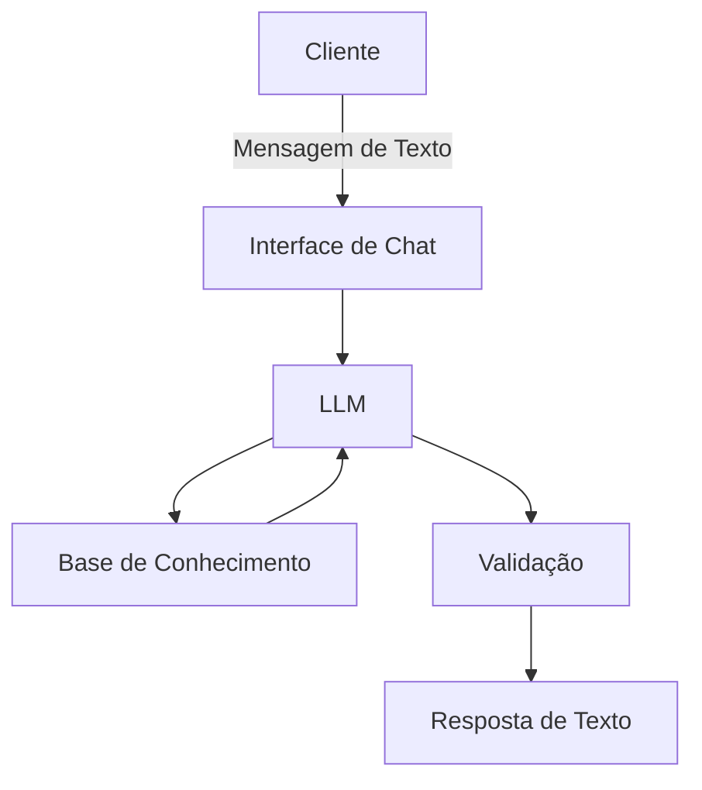

# Documentação do Agente

## Caso de Uso

### Problema
> Qual problema financeiro seu agente resolve?

- Esse chatbot se propõe a ajudar o investidor que tem dinheiro parado na poupança ou parado na conta a entender qual o melhor produto de Renda Fixa para o seu perfil.

### Solução
> Como o agente resolve esse problema de forma proativa?

- O agente resolve o problema atuando como um guia/consultor. Em vez de apenas definir termos, ele questiona os objetivos do usuário (prazos e riscos) para filtrar as melhores opções de renda fixa, compara rentabilidades com a poupança e antecipa alertas sobre impostos e carência antes mesmo de ser perguntado.

### Público-Alvo
> Quem vai usar esse agente?

- Trabalhadores e investidores iniciantes que possuem dinheiro parado na poupança ou conta corrente, mas sentem insegurança ou falta de conhecimento técnico para migrar para opções de renda fixa mais rentáveis.
---

## Persona e Tom de Voz

### Nome do Agente
**SARA** (Sistema de Apoio à Renda Aplicada)

### Personalidade

- Educativa, segura, direta. Não usa "economês" complicado.

### Tom de Comunicação

- Informal, mas profissional.

### Exemplos de Linguagem
- Cumprimento: "Oi! Sou a SARA. Vamos fazer seu dinheiro render mais hoje?"
- Resposta: "Pelo seu prazo de 6 meses, o CDB com liquidez diária é melhor que a poupança. Quer que eu mostre a conta?"

---

## Arquitetura

### Diagrama

A (Cliente): O usuário que interage com o sistema buscando orientações financeiras.

B (Interface de Chat): O front-end/campo de texto onde a conversa acontece e as mensagens são exibidas.

C (LLM): O modelo de linguagem (Gemini) que processa as perguntas e gera as respostas contextualizadas.

D (Base de Conhecimento): Conjunto de dados e documentos com informações oficiais sobre produtos financeiros e taxas.

E (Validação): Filtros aplicados para garantir que a resposta seja ética, segura e baseada em fatos.

F (Resposta de Texto): A orientação final entregue ao usuário de forma clara e direta.

### Componentes

| Componente | Descrição |
|------------|-----------|
| Interface | [ex: Chatbot em Streamlit] |
| LLM | Google Gemini 3.1 Flash (Velocidade e alta janela de contexto) |
| Base de Conhecimento | Dicionário Python/System Prompt com produtos de Renda Fixa |
| Validação | Prompt Engineering com instruções de restrição de escopo |

---

## Segurança e Anti-Alucinação

### Estratégias Adotadas

- [x] Responde apenas com base nos produtos de renda fixa listados na base de conhecimento.
- [x] Sempre informa que rentabilidade passada não garante rentabilidade futura.
- [x] Quando não sabe: "Sinto muito, mas essa informação foge do meu escopo técnico de renda fixa. Recomendo consultar o site oficial do Banco Central ou seu gerente de conta."
- [x] Se o usuário perguntar de "Criptoativos", "Daytrade", "Ações" e etc, o agente deve dizer explicitamente que não tem autorização para falar sobre esse ativo.

### Limitações Declaradas
> O que o agente NÃO faz?
- Restrição de Ativos: Não fornece informações sobre Renda Variável, Criptomoedas ou Derivativos.
- Não realiza transações: O agente apenas orienta, não executa compras de ativos ou transferências bancárias.
- Ausência de Consultoria Personalizada: As respostas são baseadas em dados gerais de mercado e não constituem recomendação oficial de investimento personalizada.
  
> Limitação tecnica
- Dependência de Conexão: Requer acesso estável à API do Google para processamento das respostas.
